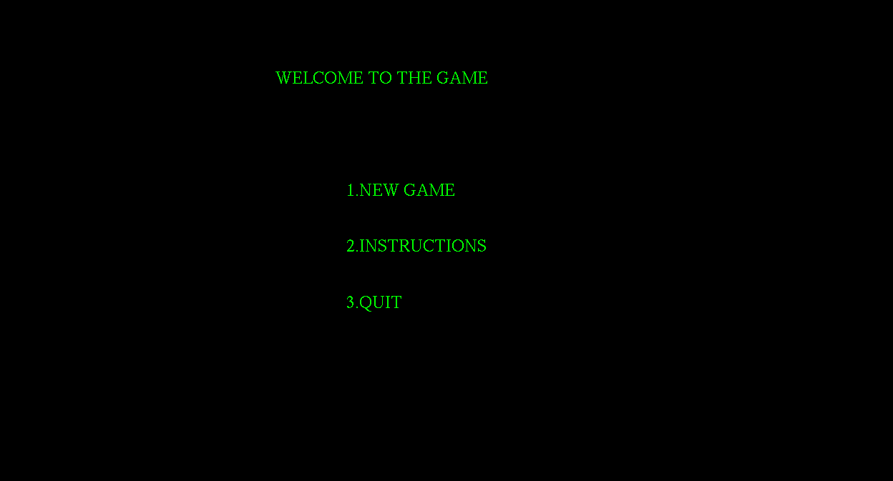
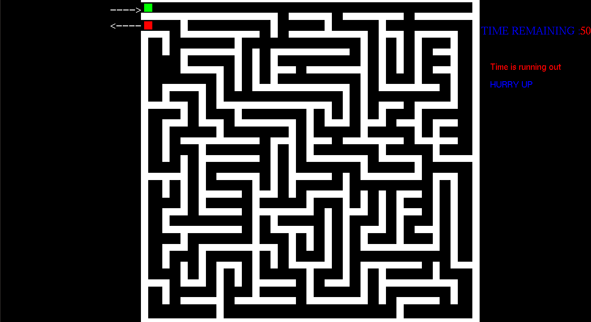
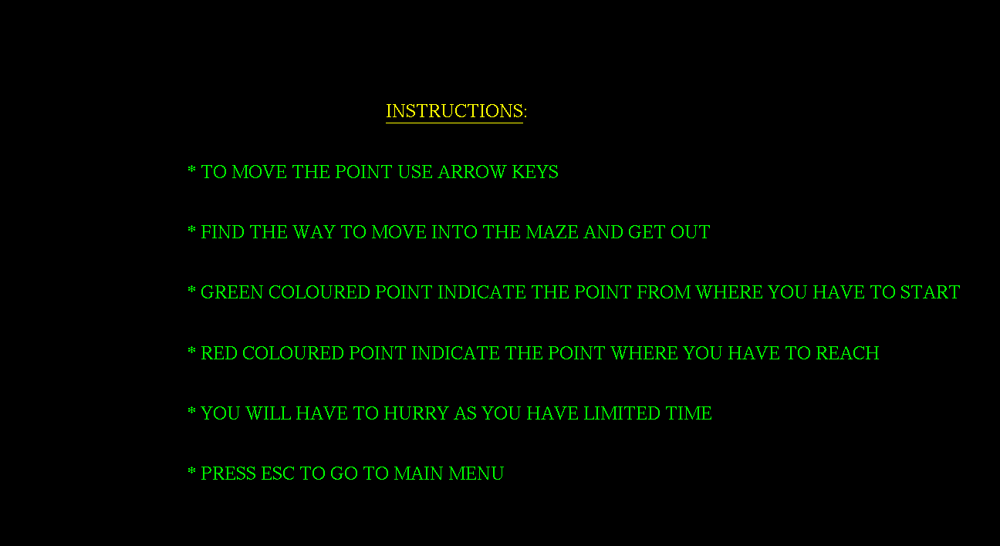

# **MAZE GAME [CGV Miniproject]**
### VTU 6th sem CSE (2021) Computer graphics mini project using OpenGL with CodeBlocks  

#### **Team Members**:
| USN  | Name  | College  |
|---|---| ---|
| 1BY18CS152  |Sheetal Neeraj|BMSIT
|  1BY18CS190 |Vishnu Sastry H K  |BMSIT

##### *Introduction* :
This is a **2D Maze game**. The game is created using **OpenGL** where, a player tries to solve the maze. The objective of the game is to navigate through the maze and complete the game within a minute.

##### *How To Run The Project* :
1) Follow this detailed instructions on installing OpenGL on Windows/Linux: https://www.youtube.com/watch?v=kbdPTNzyeIM
2) Clone the repository
3) Run the .c file on CodeBlocks on Windows or follow the steps from the video to run the program on Linux environments.
4) Do star the repository if you found it helpful :)

##### *Output[Screenshots]* :

## Thank You !!
